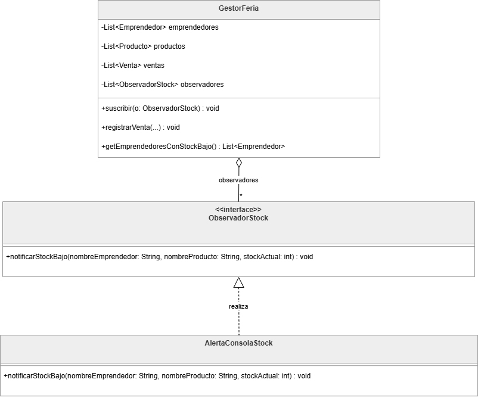

# Trabajo Practico Integrador - Metodologias de Sistemas II
## Feria de Emprendedores
## Grupo: Gianone Franco, Godoy Nahuel, Acosta Florencia
---

## Semana 1 - Refactorizacion inicial (Codigo limpio + SOLID)

### Code Smells detectados

**1. Nombres cripticos en `Emprendedor`**

Los atributos de la clase usaban nombres de una sola letra (`n`, `t`, `m`, `cat`, `prods`) que no expresan su proposito. Esto dificulta la lectura y el mantenimiento del codigo.

```java
// Antes
public String n;   // nombre
public String t;   // telefono
public String m;   // email
public String cat; // categoria
public List<Producto> prods;

// Despues
public String nombre;
public String telefono;
public String email;
public String categoria;
public List<Producto> productos;
```

---

**2. Metodo con multiples responsabilidades: `mostrarInfoYValidar()`**

El metodo construia el string de presentacion del emprendedor Y ejecutaba validaciones de negocio en el mismo lugar, mezclando dos responsabilidades distintas en un solo metodo.

```java
// Antes: un metodo que hace dos cosas
public String mostrarInfoYValidar() {
    String info = "Emprendedor: " + n + "\n";
    // ... arma el string ...
    if (n == null || n.length() < 2) {
        info += "NOMBRE DEMASIADO CORTO\n"; // validacion mezclada con presentacion
    }
    // ...
}

// Despues: solo presenta datos (la validacion ya existe en validarCompleto())
public String mostrarInfo() {
    String info = "Emprendedor: " + nombre + "\n";
    // ... solo arma el string, sin validaciones ...
    return info;
}
```

---

**3. Codigo duplicado**

Tres instancias de logica duplicada:

- `hayStockBajo()` e `isStockBajo()` en `Producto` eran identicos. Se elimino `hayStockBajo()`.
- `generarReportePorCategoriaAlternativo()` en `Reportes` duplicaba `generarReportePorCategoria()`. Se elimino el duplicado.
- La logica `p.stock < 5` estaba hardcodeada en `Reportes.imprimirResumenEjecutivo()` ignorando el metodo `isStockBajo()` ya existente.
- Acceso directo a campos internos de `GestorFeria` desde `Main` (`gestor.emprendedores.add(emp2)`) saltando la logica de registro.

---

### Refactorizaciones aplicadas

En `Emprendedor.java` se renombraron los campos cripticos: `n` paso a `nombre`, `t` a `telefono`, `m` a `email`, `cat` a `categoria` y `prods` a `productos`. Tambien se reemplazo el metodo `mostrarInfoYValidar()` por `mostrarInfo()`, que solo presenta datos sin mezclar validaciones.

En `Producto.java` se elimino el metodo `hayStockBajo()`, que era identico al ya existente `isStockBajo()`.

En `Reportes.java` se elimino el metodo `generarReportePorCategoriaAlternativo()`, que duplicaba la logica de `generarReportePorCategoria()`. Ademas, se reemplazo la condicion hardcodeada `p.stock < 5` por una llamada al metodo `p.isStockBajo()`, y el calculo inline del total facturado en `imprimirResumenEjecutivo()` fue reemplazado por una llamada al metodo `calcularVentasTotales()`.

En `GestorFeria.java` se agrego el metodo `registrarEmprendedor(Emprendedor e)` para centralizar el registro, eliminando el acceso directo a la lista interna que se hacia desde `Main.java`. Tambien se reemplazo la logica de validacion de email inline por una llamada a `Validadores.emailValido()`.

Se extrajo la interfaz `IGestorFeria` con los metodos `getEmprendedores()`, `getProductos()` y `getVentas()`. `GestorFeria` ahora la implementa y `Reportes` depende de ella en lugar de la clase concreta.

---

### Principios SOLID aplicados

**SRP - Single Responsibility Principle**

`mostrarInfoYValidar()` tenia dos responsabilidades: presentar datos y validarlos. Se separo en `mostrarInfo()` (solo presentacion). La validacion ya existia en `validarCompleto()` y en la clase `Validadores`. Cada metodo ahora tiene una sola razon para cambiar.

**DIP - Dependency Inversion Principle**

`Reportes` dependia directamente de `GestorFeria` (clase concreta). Se extrajo la interfaz `IGestorFeria` con los metodos necesarios (`getEmprendedores()`, `getProductos()`, `getVentas()`). Ahora `Reportes` depende de la abstraccion, no de la implementacion. `GestorFeria` implementa `IGestorFeria`.

```java
// Antes: dependencia directa sobre clase concreta
public String generarReportePorCategoria(GestorFeria gestor, ...) { ... }

// Despues: dependencia sobre abstraccion
public String generarReportePorCategoria(IGestorFeria gestor, ...) { ... }
```

---

## Semana 2 - Patron de diseño

### Problema 

En`GestorFeria`, el metodo getEmprendedoresConStockBajo() pedia ser llamado manualmente despues de cada venta para saber si algun producto habia quedado con stock bajo. No existia ninguna notificacion automatica

### Patron elegido: Observer

Implementamos el patron Observer para que GestorFeria notifique automaticamente cuando el stock de un producto esta por debajo de los limites al registrar una venta

- `ObservadorStock` : define el contrato `notificarStockBajo(nombreEmprendedor, nombreProducto, stockActual)`
- `AlertaConsolaStock` : imprime la alerta en consola
- `GestorFeria` : mantiene una lista de observadores y llama `notificarStockBajo()` dentro de `registrarVenta()` cuando corresponde

### Justificacion

Una solucion alternativa era llamar `getEmprendedoresConStockBajo()` manualmente desde main despues de cada venta. Funcionaba, pero acopla a quien registra ventas con la responsabilidad de revisar el stock, y si hay otros modulos que necesiten reaccionar, cada uno tendria que hacer lo mismo por su cuenta

**Implementado:** GestorFeria notifica solo a quienes se hayan suscrito, sin saber quienes son ni cuantos. Se pueden agregar nuevos observadores  sin tocar GestorFeria. La logica de ventas queda separada de la logica de reaccion ante el evento


### Diagrama UML codigo actual

---
